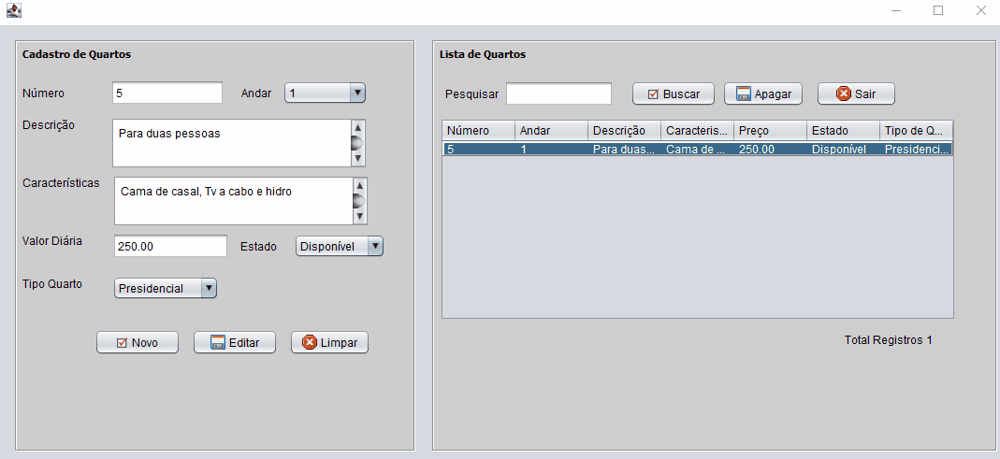

# Sistema de Reservas de Quarto
Um projeto de reservas de quartos para hoteis 🏨

[]

## Descrição

Desenvolvido em Java, destinado a gerenciar reservas em um hotel. O sistema possui uma interface gráfica amigável e está conectado a um banco de dados MySQL, utilizando servidor local XAMPP, permitindo o armazenamento, insersão, edição, recuperação e exclusão de informações sobre quartos, hóspedes, produtos e reservas de forma eficiente. Um CRUD simplificado. 🚀

## Funcionalidades ✔

- Cadastro de Hóspedes: Permite adicionar novos hóspedes ao sistema com informações como nome, documento de identidade e contato.
- Gerenciamento de Quartos: Possibilita o cadastro, edição e remoção de quartos disponíveis, incluindo informações como tipo de quarto, preço e status (disponível ou ocupado).
- Reserva de Quartos: Usuários podem fazer reservas de quartos, especificando a data de entrada e saída, além de associar a reserva a um hóspede.
- Relatórios: Geração de relatórios sobre reservas, hóspedes e ocupação dos quartos.
- Interface Gráfica: Uma interface intuitiva e responsiva que facilita a navegação e o uso do sistema.

## Tecnologias Utilizadas

- Linguagem de Programação: Java
- Banco de Dados: MySQL
- Interface Gráfica: Java Swing

## Requisitos

- JDK 11 ou superior
- MySQL Workbanch & XAMPP (Servidor Local)
- Bibliotecas Java Swing

## Contribuição

Contribuições são sempre bem-vindas! Se você tiver sugestões ou melhorias, fique à vontade para abrir uma issue ou enviar um pull request.

## Contato

Para mais informações, entre em contato:
- Nome: Caio Filardis
- Email: caio.filardis@hotmail.com
- Linkedin: https://www.linkedin.com/in/caio-filardis1891

